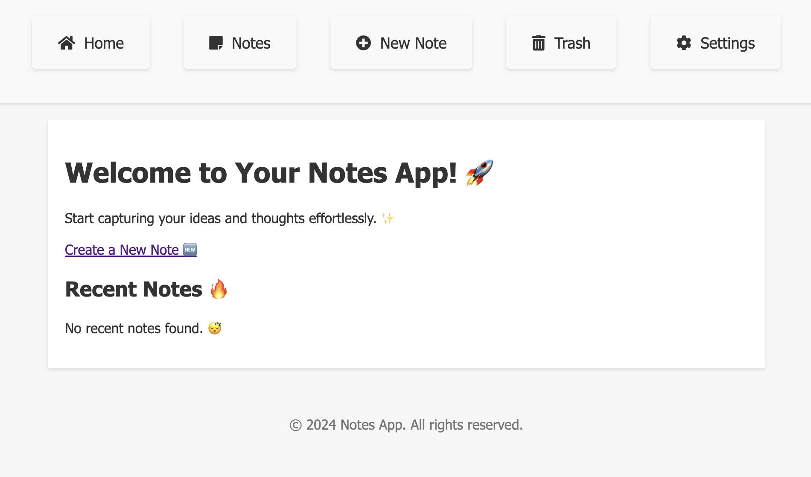

# Noted

Noted is a simple and intuitive note-taking application built with Flask. It allows you to create, edit, and delete notes effortlessly.

## Features

- Create notes with a title and content
- Edit and delete existing notes
- Responsive design for a seamless experience on any device
- Search functionality for searching through the notes

## Installation

1. Clone the repository:

   <code>git clone https://github.com/cosmini0/Noted.git</code>

2. Navigate to the project directory:

   <code>cd Noted</code>

3. Install the required dependencies:

   <code>pip install -r requirements.txt</code>

4. Run the application:

   <code>python app.py</code>

5. Open your web browser and visit <code>http://localhost:5000</code> to access Noted.

---

Start capturing your thoughts with Noted today! ✨📝
